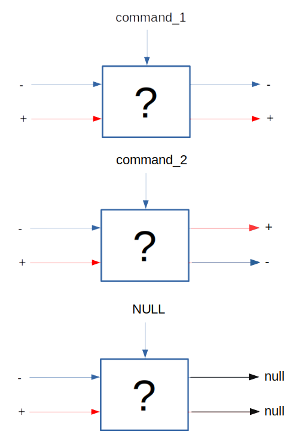

## Описание

Проект "бимо" на базе игрушечной машины, упрваляемой с помощью платы Arduino Nano. Arduino отвечает за базовую прошивку: движение машины, повороты... При внедрении ComputerVision, будет организован канал связи между Arduino и Raspberry Pi. Последний будет производить более сложные вычисления и регулировать движение машинки.

## Выполнено:

1. Подан сигнал на LED с Raspberry Pi 3. [Программа](./RPi/c_blink/blink.c) написана на C. К пинам **0, 2, 3** подключены по одному светодиоду. Программа поочередно загижает каждый из них с интервалом 500 мс.
В программе использована библиотека *wiringPi*. Поэтому компиляция подобных файлов производится с явным указанием используемой библиотеки:

###
	gcc blink.c -lwiringPi
###

2. Написана функция **set_pwm**:
###
	void set_pwm(unsigned int pin, unsigned int dry_cycle, unsigned int freq, ssize_t timer);
###

...где *pin* - номер пина, на который подается ШИМ-сигнал,
*dry_cycle* - скважность,
*freq* - частота импульсов,
*timer* - время работы программы

Можно запустить [программу](./RPi/c_blink/pwm_led_new.c) на любом ПК, при этом результаты работы будут отображаться в терминале. Для этого необходимо раскомментировать функции *delay*, *digitalWrite* и закомментировать строки в *main*:
###
	wiringPiSetup();
	pinMode (PIN_PWM, OUTPUT);
###

3. Реализована подача сигнала на LED через Arduino.

4. Подключен фоторезистор к аналоговому пину Arduino. !!!Разобраться, почему результат функции  analogRead обратно пропорционален напряжению на фоторезисторе (??? возможно проблема в неправильном подключении и замер производился с постоянного резистора).

5. Подключен сервопривод SG90 "напрямую" к Arduino.

## ToDo:

1. Переписать функцию генерации ШИМ так, чтобы импульсы были синхронизированы со встроенным в Arduino таймером либо использовать готовые библиотеки. Подробнее [на сайте AlexGyver'a](https://alexgyver.ru/lessons/pwm-signal/)

2. Узнать, можно ли использовать программы, написанные на языке Си в Arduino.
з.ы.

Да, можно [Тут](http://studrobots.ru/arduino-c-1/) простой пример, [а тут](https://habr.com/ru/post/247663/) более сложный с написанием Makefile'а и подключением библиотек.

3. Подумать, как организовать повороты колес машинки. Проблема пока заключается в выборе "железа" (2 транзистора???).

.

4. Подключить моторчик через драйвер HW-130 к Arduino.

5. Реалиовать подачу ШИМ-сигнала на моторчик через драйвер HW-130.

6. Написать программу-прошивку для машинки на Arduino.

7. Организовать канал связи между Arduino Nano и Raspberry Pi.